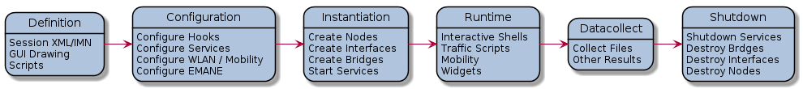

# CORE Architecture

* Table of Contents
{:toc}

## Main Components

* core-daemon
  * Manages emulated sessions of nodes and links for a given network
  * Nodes are created using Linux namespaces
  * Links are created using Linux bridges and virtual ethernet peers
  * Packets sent over links are manipulated using traffic control
  * Controlled via the CORE GUI
  * Provides both a custom TLV API and gRPC API
  * Python program that leverages a small C binary for node creation
* core-gui
  * GUI and daemon communicate over the custom TLV API
  * Drag and drop creation for nodes and links
  * Can launch terminals for emulated nodes in running sessions
  * Can save/open scenario files to recreate previous sessions
  * TCL/TK program
* coresendmsg
  * Command line utility for sending TLV API messages to the core-daemon
* vcmd
  * Command line utility for sending shell commands to nodes

## Sessions

CORE can create and run multiple emulated sessions at once, below is an
overview of the states a session will transition between during typical
GUI interactions.

## How Does it Work?

The CORE framework runs on Linux and uses Linux namespacing for creating
node containers. These nodes are linked together using Linux bridging and
virtual interfaces. CORE sessions are a set of nodes and links operating
together for a specific purpose.

### Linux

Linux network namespaces (also known as netns) is the primary
technique used by CORE. Most recent Linux distributions have
namespaces-enabled kernels out of the box. Each namespace has its own process
environment and private network stack. Network namespaces share the same
filesystem in CORE.

CORE combines these namespaces with Linux Ethernet bridging to form networks.
Link characteristics are applied using Linux Netem queuing disciplines.
Nftables provides Ethernet frame filtering on Linux bridges. Wireless networks are
emulated by controlling which interfaces can send and receive with nftables
rules.

## Prior Work

The Tcl/Tk CORE GUI was originally derived from the open source
[IMUNES](http://imunes.net) project from the University of Zagreb as a custom
project within Boeing Research and Technology's Network Technology research
group in 2004. Since then they have developed the CORE framework to use Linux
namespacing, have developed a Python framework, and made numerous user and
kernel-space developments, such as support for wireless networks, IPsec,
distribute emulation, simulation integration, and more. The IMUNES project
also consists of userspace and kernel components.

## Open Source Project and Resources

CORE has been released by Boeing to the open source community under the BSD
license. If you find CORE useful for your work, please contribute back to the
project. Contributions can be as simple as reporting a bug, dropping a line of
encouragement or technical suggestions to the mailing lists, or can also
include submitting patches or maintaining aspects of the tool.
