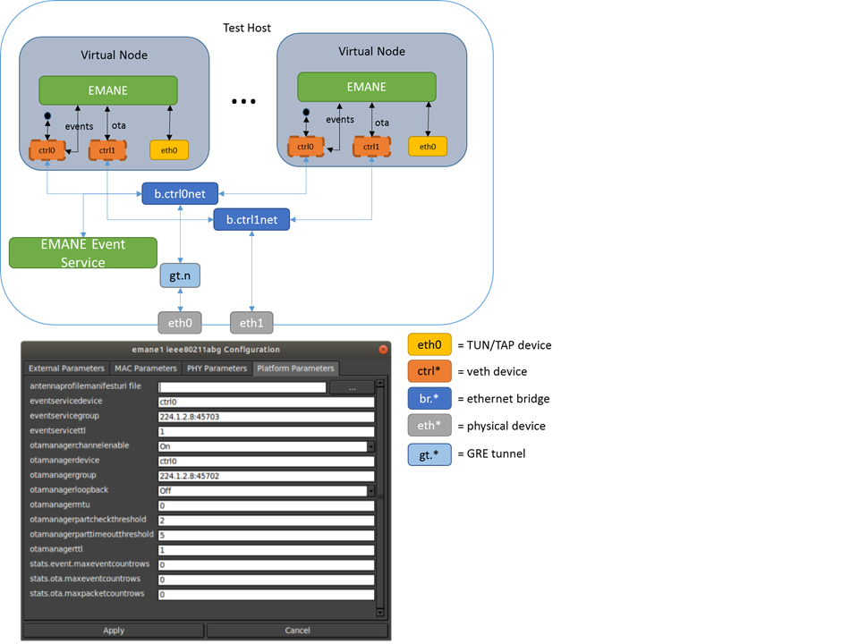

# CORE/EMANE

* Table of Contents
{:toc}

## What is EMANE?

The Extendable Mobile Ad-hoc Network Emulator (EMANE) allows heterogeneous
network emulation using a pluggable MAC and PHY layer architecture. The
EMANE framework provides an implementation architecture for modeling
different radio interface types in the form of *Network Emulation Modules*
(NEMs) and incorporating these modules into a real-time emulation running
in a distributed environment.

EMANE is developed by U.S. Naval Research Labs (NRL) Code 5522 and Adjacent
Link LLC, who maintain these websites:

* <https://github.com/adjacentlink/emane>
* <http://www.adjacentlink.com/>

Instead of building Linux Ethernet bridging networks with CORE,
higher-fidelity wireless networks can be emulated using EMANE bound to virtual
devices. CORE emulates layers 3 and above (network, session, application) with
its virtual network stacks and process space for protocols and applications,
while EMANE emulates layers 1 and 2 (physical and data link) using its
pluggable PHY and MAC models.

The interface between CORE and EMANE is a TAP device. CORE builds the virtual
node using Linux network namespaces, installs the TAP device into the namespace
and instantiates one EMANE process in the namespace. The EMANE process binds a
user space socket to the TAP device for sending and receiving data from CORE.

An EMANE instance sends and receives OTA (Over-The-Air) traffic to and from
other EMANE instances via a control port (e.g. *ctrl0*, *ctrl1*).  It also
sends and receives Events to and from the Event Service using the same or a
different control port. EMANE models are configured through CORE's WLAN
configuration dialog. A corresponding EmaneModel Python class is sub-classed
for each supported EMANE model, to provide configuration items and their
mapping to XML files. This way new models can be easily supported. When
CORE starts the emulation, it generates the appropriate XML files that
specify the EMANE NEM configuration, and launches the EMANE daemons.

Some EMANE models support location information to determine when packets
should be dropped. EMANE has an event system where location events are
broadcast to all NEMs. CORE can generate these location events when nodes
are moved on the canvas. The canvas size and scale dialog has controls for
mapping the X,Y coordinate system to a latitude, longitude geographic system
that EMANE uses. When specified in the *core.conf* configuration file, CORE
can also subscribe to EMANE location events and move the nodes on the canvas
as they are moved in the EMANE emulation. This would occur when an Emulation
Script Generator, for example, is running a mobility script.

## EMANE Installation

EMANE can be installed from deb or RPM packages or from source. See the
[EMANE GitHub](https://github.com/adjacentlink/emane) for full details.

Here are quick instructions for installing all EMANE packages for Ubuntu 18.04:
```shell
# install dependencies
sudo apt-get install libssl-dev libxml-libxml-perl libxml-simple-perl
wget https://adjacentlink.com/downloads/emane/emane-1.2.5-release-1.ubuntu-18_04.amd64.tar.gz
tar xzf emane-1.2.5-release-1.ubuntu-18_04.amd64.tar.gz
# install base emane packages
sudo dpkg -i emane-1.2.5-release-1/deb/ubuntu-18_04/amd64/emane*.deb
# install python3 bindings
sudo dpkg -i emane-1.2.5-release-1/deb/ubuntu-18_04/amd64/python3*.deb
```

## EMANE Configuration

The CORE configuration file **/etc/core/core.conf** has options specific to
EMANE. An example emane section from the **core.conf** file is shown below:

```shell
# EMANE configuration
emane_platform_port = 8101
emane_transform_port = 8201
emane_event_monitor = False
#emane_models_dir = /home/username/.core/myemane
# EMANE log level range [0,4] default: 2
emane_log_level = 2
emane_realtime = True
# prefix used for emane installation
# emane_prefix = /usr
```

If you have an EMANE event generator (e.g. mobility or pathloss scripts) and
want to have CORE subscribe to EMANE location events, set the following line
in the **core.conf** configuration file.

> **NOTE:** Do not set this option to True if you want to manually drag nodes around
on the canvas to update their location in EMANE.

```shell
emane_event_monitor = True
```

Another common issue is if installing EMANE from source, the default configure
prefix will place the DTD files in **/usr/local/share/emane/dtd** while CORE
expects them in **/usr/share/emane/dtd**.

Update the EMANE prefix configuration to resolve this problem.
```shell
emane_prefix = /usr/local
```

## Custom EMANE Models

CORE supports custom developed EMANE models by way of dynamically loading user
created python files that represent the model. Custom EMANE models should be
placed within the path defined by **emane_models_dir** in the CORE
configuration file. This path cannot end in **/emane**.

Here is an example model with documentation describing functionality:
[Example Model](../daemon/examples/myemane/examplemodel.py)

## Single PC with EMANE

This section describes running CORE and EMANE on a single machine. This is the
default mode of operation when building an EMANE network with CORE. The OTA
manager and Event service interface are set to use *ctrl0* and the virtual
nodes use the primary control channel for communicating with one another. The
primary control channel is automatically activated when a scenario involves
EMANE. Using the primary control channel prevents your emulation session from
sending multicast traffic on your local network and interfering with other
EMANE users.

EMANE is configured through a WLAN node, because it is all about emulating
wireless radio networks. Once a node is linked to a WLAN cloud configured
with an EMANE model, the radio interface on that node may also be configured
separately (apart from the cloud.)

Double-click on a WLAN node to invoke the WLAN configuration dialog. Click
the *EMANE* tab; when EMANE has been properly installed, EMANE wireless modules
should be listed in the *EMANE Models* list. (You may need to restart the
CORE daemon if it was running prior to installing the EMANE Python bindings.)
Click on a model name to enable it.

When an EMANE model is selected in the *EMANE Models* list, clicking on the
*model options* button causes the GUI to query the CORE daemon for
configuration items. Each model will have different parameters, refer to the
EMANE documentation for an explanation of each item. The defaults values are
presented in the dialog. Clicking *Apply*  and *Apply* again will store the
EMANE model selections.

The *EMANE options* button allows specifying some global parameters for
EMANE, some of which are necessary for distributed operation.

The RF-PIPE and IEEE 802.11abg models use a Universal PHY that supports
geographic location information for determining pathloss between nodes. A
default latitude and longitude location is provided by CORE and this
location-based pathloss is enabled by default; this is the *pathloss mode*
setting for the Universal PHY.  Moving a node on the canvas while the
emulation is running generates location events for EMANE. To view or change
the geographic location or scale of the canvas use the *Canvas Size and Scale*
dialog available from the *Canvas* menu.

Note that conversion between geographic and Cartesian coordinate systems is
done using UTM (Universal Transverse Mercator) projection, where different
zones of 6 degree longitude bands are defined. The location events generated
by CORE may become inaccurate near the zone boundaries for very large scenarios
that span multiple UTM zones. It is recommended that EMANE location scripts be
used to achieve geo-location accuracy in this situation.

Clicking the green *Start* button launches the emulation and causes TAP devices
to be created in the virtual nodes that are linked to the EMANE WLAN. These
devices appear with interface names such as eth0, eth1, etc. The EMANE processes
should now be running in each namespace. For a four node scenario:

```shell
ps -aef | grep emane
root  1063 969 0 11:46 ? 00:00:00 emane -d --logl 3 -r -f /tmp/pycore.59992/emane4.log /tmp/pycore.59992/platform4.xml
root  1117 959 0 11:46 ? 00:00:00 emane -d --logl 3 -r -f /tmp/pycore.59992/emane2.log /tmp/pycore.59992/platform2.xml
root  1179 942 0 11:46 ? 00:00:00 emane -d --logl 3 -r -f /tmp/pycore.59992/emane1.log /tmp/pycore.59992/platform1.xml
root  1239 979 0 11:46 ? 00:00:00 emane -d --logl 3 -r -f /tmp/pycore.59992/emane5.log /tmp/pycore.59992/platform5.xml
```

The example above shows the EMANE processes started by CORE. To view the
configuration generated by CORE, look in the */tmp/pycore.nnnnn/* session
directory for a *platform.xml* file and other XML files. One easy way to view
this information is by double-clicking one of the virtual nodes, and typing
*cd ..* in the shell to go up to the session directory.


## Distributed EMANE

Running CORE and EMANE distributed among two or more emulation servers is
similar to running on a single machine. There are a few key configuration
items that need to be set in order to be successful, and those are outlined here.

It is a good idea to maintain separate networks for data (OTA) and control.
The control network may be a shared laboratory network, for example, and you do
not want multicast traffic on the data network to interfere with other EMANE
users. Furthermore, control traffic could interfere with the OTA latency and
throughput and might affect emulation fidelity. The examples described here will
use *eth0* as a control interface and *eth1* as a data interface, although
using separate interfaces is not strictly required. Note that these interface
names refer to interfaces present on the host machine, not virtual interfaces
within a node.

**IMPORTANT: If an auxiliary control network is used, an interface on the host
has to be assigned to that network.**

Each machine that will act as an emulation server needs to have CORE and EMANE
installed.

The IP addresses of the available servers are configured from the CORE emulation
servers dialog box (choose *Session* then *Emulation servers...*). This list of
servers is stored in a *~/.core/servers.conf* file. The dialog shows available
servers, some or all of which may be assigned to nodes on the canvas.

Nodes need to be assigned to emulation servers. Select several nodes,
right-click them, and choose *Assign to* and the name of the desired server.
When a node is not assigned to any emulation server, it will be emulated
locally. The local machine that the GUI connects with is considered the
"master" machine, which in turn connects to the other emulation server
"slaves". Public key SSH should be configured from the master to the slaves.

Under the *EMANE* tab of the EMANE WLAN, click on the *EMANE options* button.
This brings up the emane configuration dialog. The *enable OTA Manager channel*
should be set to *on*. The *OTA Manager device* and *Event Service device*
should be set to a control network device. For example, if you have a primary
and auxiliary control network (i.e. controlnet and controlnet1), and you want
the OTA traffic to have its dedicated network, set the OTA Manager device to
*ctrl1* and the Event Service device to *ctrl0*. The EMANE models can be
configured. Click *Apply* to save these settings.



> **NOTE:** Here is a quick checklist for distributed emulation with EMANE.

   1. Follow the steps outlined for normal CORE.
   2. Under the *EMANE* tab of the EMANE WLAN, click on *EMANE options*.
   3. Turn on the *OTA Manager channel* and set the *OTA Manager device*.
      Also set the *Event Service device*.
   4. Select groups of nodes, right-click them, and assign them to servers
      using the *Assign to* menu.
   5. Synchronize your machine's clocks prior to starting the emulation,
      using *ntp* or *ptp*. Some EMANE models are sensitive to timing.
   6. Press the *Start* button to launch the distributed emulation.


Now when the Start button is used to instantiate the emulation, the local CORE
Python daemon will connect to other emulation servers that have been assigned
to nodes. Each server will have its own session directory where the
*platform.xml* file and other EMANE XML files are generated. The NEM IDs are
automatically coordinated across servers so there is no overlap. Each server
also gets its own Platform ID.

An Ethernet device is used for disseminating multicast EMANE events, as
specified in the *configure emane* dialog. EMANE's Event Service can be run
with mobility or pathloss scripts as described in :ref:`Single_PC_with_EMANE`.
If CORE is not subscribed to location events, it will generate them as nodes
are moved on the canvas.

Double-clicking on a node during runtime will cause the GUI to attempt to SSH
to the emulation server for that node and run an interactive shell. The public
key SSH configuration should be tested with all emulation servers prior to
starting the emulation.


