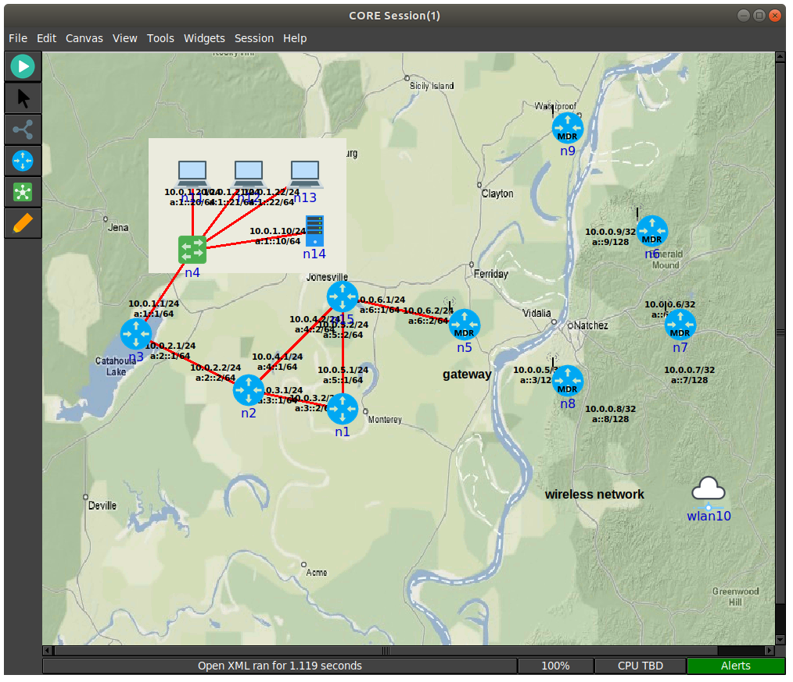

# CORE GUI



## Overview

The GUI is used to draw nodes and network devices on a canvas, linking them
together to create an emulated network session.

After pressing the start button, CORE will proceed through these phases,
staying in the **runtime** phase. After the session is stopped, CORE will
proceed to the **data collection** phase before tearing down the emulated
state.

CORE can be customized to perform any action at each state. See the
**Hooks...** entry on the [Session Menu](#session-menu) for details about
when these session states are reached.

## Prerequisites

Beyond installing CORE, you must have the CORE daemon running. This is done
on the command line with either systemd or sysv.

```shell
# systemd service
sudo systemctl daemon-reload
sudo systemctl start core-daemon

# direct invocation
sudo core-daemon
```

## GUI Files

The GUI will create a directory in your home directory on first run called
~/.coregui. This directory will help layout various files that the GUI may use.

* .coregui/
    * backgrounds/
        * place backgrounds used for display in the GUI
    * custom_emane/
        * place to keep custom emane models to use with the core-daemon
    * custom_services/
        * place to keep custom services to use with the core-daemon
    * icons/
        * icons the GUI uses along with customs icons desired
    * mobility/
        * place to keep custom mobility files
    * scripts/
        * place to keep core related scripts
    * xmls/
        * place to keep saved session xml files
    * gui.log
        * log file when running the gui, look here when issues occur for exceptions etc
    * config.yaml
        * configuration file used to save/load various gui related settings (custom nodes, layouts, addresses, etc)

## Modes of Operation

The CORE GUI has two primary modes of operation, **Edit** and **Execute**
modes. Running the GUI, by typing **core-gui** with no options, starts in
Edit mode. Nodes are drawn on a blank canvas using the toolbar on the left
and configured from right-click menus or by double-clicking them. The GUI
does not need to be run as root.

Once editing is complete, pressing the green **Start** button instantiates
the topology and enters Execute mode. In execute mode,
the user can interact with the running emulated machines by double-clicking or
right-clicking on them. The editing toolbar disappears and is replaced by an
execute toolbar, which provides tools while running the emulation. Pressing
the red **Stop** button will destroy the running emulation and return CORE
to Edit mode.

Once the emulation is running, the GUI can be closed, and a prompt will appear
asking if the emulation should be terminated. The emulation may be left
running and the GUI can reconnect to an existing session at a later time.

The GUI can be run as a normal user on Linux.

The GUI currently provides the following options on startup.

```shell
usage: core-gui [-h] [-l {DEBUG,INFO,WARNING,ERROR,CRITICAL}] [-p]
                [-s SESSION] [--create-dir]

CORE Python GUI

optional arguments:
  -h, --help            show this help message and exit
  -l {DEBUG,INFO,WARNING,ERROR,CRITICAL}, --level {DEBUG,INFO,WARNING,ERROR,CRITICAL}
                        logging level
  -p, --proxy           enable proxy
  -s SESSION, --session SESSION
                        session id to join
  --create-dir          create gui directory and exit
```

## Toolbar

The toolbar is a row of buttons that runs vertically along the left side of the
CORE GUI window. The toolbar changes depending on the mode of operation.

### Editing Toolbar

When CORE is in Edit mode (the default), the vertical Editing Toolbar exists on
the left side of the CORE window. Below are brief descriptions for each toolbar
item, starting from the top. Most of the tools are grouped into related
sub-menus, which appear when you click on their group icon.

| Icon                       | Name           | Description                                                                            |
|----------------------------|----------------|----------------------------------------------------------------------------------------|
|  | Selection Tool | Tool for selecting, moving, configuring nodes.                                         |
|   | Start Button   | Starts Execute mode, instantiates the emulation.                                       |
|    | Link           | Allows network links to be drawn between two nodes by clicking and dragging the mouse. |

### CORE Nodes

These nodes will create a new node container and run associated services.

| Icon                       | Name    | Description                                                                  |
|----------------------------|---------|------------------------------------------------------------------------------|
|  | Router  | Runs Quagga OSPFv2 and OSPFv3 routing to forward packets.                    |
|    | Host    | Emulated server machine having a default route, runs SSH server.             |
|      | PC      | Basic emulated machine having a default route, runs no processes by default. |
|     | MDR     | Runs Quagga OSPFv3 MDR routing for MANET-optimized routing.                  |
|  | PRouter | Physical router represents a real testbed machine.                           |

### Network Nodes

These nodes are mostly used to create a Linux bridge that serves the
purpose described below.

| Icon                          | Name         | Description                                                                                                                                                                                                                                        |
|-------------------------------|--------------|----------------------------------------------------------------------------------------------------------------------------------------------------------------------------------------------------------------------------------------------------|
|        | Hub          | Ethernet hub forwards incoming packets to every connected node.                                                                                                                                                                                    |
|  | Switch       | Ethernet switch intelligently forwards incoming packets to attached hosts using an Ethernet address hash table.                                                                                                                                    |
|       | Wireless LAN | When routers are connected to this WLAN node, they join a wireless network and an antenna is drawn instead of a connecting line; the WLAN node typically controls connectivity between attached wireless nodes based on the distance between them. |
|       | RJ45         | RJ45 Physical Interface Tool, emulated nodes can be linked to real physical interfaces; using this tool, real networks and devices can be physically connected to the live-running emulation.                                                      |
|     | Tunnel       | Tool allows connecting together more than one CORE emulation using GRE tunnels.                                                                                                                                                                    |

### Annotation Tools

| Icon                          | Name      | Description                                                         |
|-------------------------------|-----------|---------------------------------------------------------------------|
|     | Marker    | For drawing marks on the canvas.                                    |
|       | Oval      | For drawing circles on the canvas that appear in the background.    |
|  | Rectangle | For drawing rectangles on the canvas that appear in the background. |
|       | Text      | For placing text captions on the canvas.                            |

### Execution Toolbar

When the Start button is pressed, CORE switches to Execute mode, and the Edit
toolbar on the left of the CORE window is replaced with the Execution toolbar
Below are the items on this toolbar, starting from the top.

| Icon                       | Name           | Description                                                                                                                                                                                                                                                                                                                                                                                                                                                                                                                                                                                                 |
|----------------------------|----------------|-------------------------------------------------------------------------------------------------------------------------------------------------------------------------------------------------------------------------------------------------------------------------------------------------------------------------------------------------------------------------------------------------------------------------------------------------------------------------------------------------------------------------------------------------------------------------------------------------------------|
|    | Stop Button    | Stops Execute mode, terminates the emulation, returns CORE to edit mode.                                                                                                                                                                                                                                                                                                                                                                                                                                                                                                                                    |
|  | Selection Tool | In Execute mode, the Selection Tool can be used for moving nodes around the canvas, and double-clicking on a node will open a shell window for that node; right-clicking on a node invokes a pop-up menu of run-time options for that node.                                                                                                                                                                                                                                                                                                                                                                 |
|  | Marker         | For drawing freehand lines on the canvas, useful during demonstrations; markings are not saved.                                                                                                                                                                                                                                                                                                                                                                                                                                                                                                             |
|     | Run Tool       | This tool allows easily running a command on all or a subset of all nodes. A list box allows selecting any of the nodes. A text entry box allows entering any command. The command should return immediately, otherwise the display will block awaiting response. The *ping* command, for example, with no parameters, is not a good idea. The result of each command is displayed in a results box. The first occurrence of the special text "NODE" will be replaced with the node name. The command will not be attempted to run on nodes that are not routers, PCs, or hosts, even if they are selected. |

## Menu

The menubar runs along the top of the CORE GUI window and provides access to a
variety of features. Some of the menus are detachable, such as the *Widgets*
menu, by clicking the dashed line at the top.

### File Menu

The File menu contains options for saving and opening saved sessions.

| Option                | Description                                                                                                                                                                                                                                                                                                                                                 |
|-----------------------|-------------------------------------------------------------------------------------------------------------------------------------------------------------------------------------------------------------------------------------------------------------------------------------------------------------------------------------------------------------|
| New Session           | This starts a new session with an empty canvas.                                                                                                                                                                                                                                                                                                             |
| Save                  | Saves the current topology. If you have not yet specified a file name, the Save As dialog box is invoked.                                                                                                                                                                                                                                                   |
| Save As               | Invokes the Save As dialog box for selecting a new **.xml** file for saving the current configuration in the XML file.                                                                                                                                                                                                                                      |
| Open                  | Invokes the File Open dialog box for selecting a new XML file to open.                                                                                                                                                                                                                                                                                      |
| Recently used files   | Above the Quit menu command is a list of recently use files, if any have been opened. You can clear this list in the Preferences dialog box. You can specify the number of files to keep in this list from the Preferences dialog. Click on one of the file names listed to open that configuration file.                                                   |
| Execute Python Script | Invokes a File Open dialog box for selecting a Python script to run and automatically connect to. After a selection is made, a Python Script Options dialog box is invoked to allow for command-line options to be added. The Python script must create a new CORE Session and add this session to the daemon's list of sessions in order for this to work. |
| Quit                  | The Quit command should be used to exit the CORE GUI. CORE may prompt for termination if you are currently in Execute mode. Preferences and the recently-used files list are saved.                                                                                                                                                                         |

### Edit Menu

| Option                   | Description                                                                                                                                                                                                                                                                                                                                                                                                                                 |
|--------------------------|---------------------------------------------------------------------------------------------------------------------------------------------------------------------------------------------------------------------------------------------------------------------------------------------------------------------------------------------------------------------------------------------------------------------------------------------|
| Preferences              | Invokes the Preferences dialog box.                                                                                                                                                                                                                                                                                                                                                                                                         |
| Custom Nodes             | Custom node creation dialog box.                                                                                                                                                                                                                                                                                                                                                                                                            |
| Undo                     | (Disabled) Attempts to undo the last edit in edit mode.                                                                                                                                                                                                                                                                                                                                                                                     |
| Redo                     | (Disabled) Attempts to redo an edit that has been undone.                                                                                                                                                                                                                                                                                                                                                                                   |
| Cut, Copy, Paste, Delete | Used to cut, copy, paste, and delete a selection. When nodes are pasted, their node numbers are automatically incremented, and existing links are preserved with new IP addresses assigned. Services and their customizations are copied to the new node, but care should be taken as node IP addresses have changed with possibly old addresses remaining in any custom service configurations. Annotations may also be copied and pasted. |

### Canvas Menu

The canvas menu provides commands related to the editing canvas.

| Option     | Description                                                                                                                                                                                                                                                                                                                                                                                                                                                                                                                                                                                                                                     |
|------------|-------------------------------------------------------------------------------------------------------------------------------------------------------------------------------------------------------------------------------------------------------------------------------------------------------------------------------------------------------------------------------------------------------------------------------------------------------------------------------------------------------------------------------------------------------------------------------------------------------------------------------------------------|
| Size/scale | Invokes a Canvas Size and Scale dialog that allows configuring the canvas size, scale, and geographic reference point. The size controls allow changing the width and height of the current canvas, in pixels or meters. The scale allows specifying how many meters are equivalent to 100 pixels. The reference point controls specify the latitude, longitude, and altitude reference point used to convert between geographic and Cartesian coordinate systems. By clicking the *Save as default* option, all new canvases will be created with these properties. The default canvas size can also be changed in the Preferences dialog box. |
| Wallpaper  | Used for setting the canvas background image.                                                                                                                                                                                                                                                                                                                                                                                                                                                                                                                                                                                                   |

### View Menu

The View menu features items for toggling on and off their display on the canvas.

| Option          | Description                       |
|-----------------|-----------------------------------|
| Interface Names | Display interface names on links. |
| IPv4 Addresses  | Display IPv4 addresses on links.  |
| IPv6 Addresses  | Display IPv6 addresses on links.  |
| Node Labels     | Display node names.               |
| Link Labels     | Display link labels.              |
| Annotations     | Display annotations.              |
| Canvas Grid     | Display the canvas grid.          |

### Tools Menu

The tools menu lists different utility functions.

| Option        | Description                                                                                                                                                                                                                                        |
|---------------|----------------------------------------------------------------------------------------------------------------------------------------------------------------------------------------------------------------------------------------------------|
| Find          | Display find dialog used for highlighting a node on the canvas.                                                                                                                                                                                    |
| Auto Grid     | Automatically layout nodes in a grid.                                                                                                                                                                                                              |
| IP addresses  | Invokes the IP Addresses dialog box for configuring which IPv4/IPv6 prefixes are used when automatically addressing new interfaces.                                                                                                                |
| MAC addresses | Invokes the MAC Addresses dialog box for configuring the starting number used as the lowest byte when generating each interface MAC address. This value should be changed when tunneling between CORE emulations to prevent MAC address conflicts. |

### Widgets Menu

Widgets are GUI elements that allow interaction with a running emulation.
Widgets typically automate the running of commands on emulated nodes to report
status information of some type and display this on screen.

#### Periodic Widgets

These Widgets are those available from the main *Widgets* menu. More than one
of these Widgets may be run concurrently. An event loop fires once every second
that the emulation is running. If one of these Widgets is enabled, its periodic
routine will be invoked at this time. Each Widget may have a configuration
dialog box which is also accessible from the *Widgets* menu.

Here are some standard widgets:

* **Adjacency** - displays router adjacency states for Quagga's OSPFv2 and OSPFv3
  routing protocols. A line is drawn from each router halfway to the router ID
  of an adjacent router. The color of the line is based on the OSPF adjacency
  state such as Two-way or Full. To learn about the different colors, see the
  *Configure Adjacency...* menu item. The **vtysh** command is used to
  dump OSPF neighbor information.
  Only half of the line is drawn because each
  router may be in a different adjacency state with respect to the other.
* **Throughput** - displays the kilobits-per-second throughput above each link,
  using statistics gathered from each link. If the throughput exceeds a certain
  threshold, the link will become highlighted. For wireless nodes which broadcast
  data to all nodes in range, the throughput rate is displayed next to the node and
  the node will become circled if the threshold is exceeded.

#### Observer Widgets

These Widgets are available from the **Observer Widgets** submenu of the
**Widgets** menu, and from the Widgets Tool on the toolbar. Only one Observer Widget may
be used at a time. Mouse over a node while the session is running to pop up
an informational display about that node.

Available Observer Widgets include IPv4 and IPv6 routing tables, socket
information, list of running processes, and OSPFv2/v3 neighbor information.

Observer Widgets may be edited by the user and rearranged. Choosing
**Widgets->Observer Widgets->Edit Observers** from the Observer Widget menu will
invoke the Observer Widgets dialog. A list of Observer Widgets is displayed along
with up and down arrows for rearranging the list. Controls are available for
renaming each widget, for changing the command that is run during mouse over, and
for adding and deleting items from the list. Note that specified commands should
return immediately to avoid delays in the GUI display. Changes are saved to a
**config.yaml** file in the CORE configuration directory.

### Session Menu

The Session Menu has entries for starting, stopping, and managing sessions,
in addition to global options such as node types, comments, hooks, servers,
and options.

| Option   | Description                                                                                                                                                                                                                                                                                                                                                                                                                                                         |
|----------|---------------------------------------------------------------------------------------------------------------------------------------------------------------------------------------------------------------------------------------------------------------------------------------------------------------------------------------------------------------------------------------------------------------------------------------------------------------------|
| Sessions | Invokes the CORE Sessions dialog box containing a list of active CORE sessions in the daemon. Basic session information such as name, node count, start time, and a thumbnail are displayed. This dialog allows connecting to different sessions, shutting them down, or starting a new session.                                                                                                                                                                    |
| Servers  | Invokes the CORE emulation servers dialog for configuring.                                                                                                                                                                                                                                                                                                                                                                                                          |
| Options  | Presents per-session options, such as the IPv4 prefix to be used, if any, for a control network the ability to preserve the session directory; and an on/off switch for SDT3D support.                                                                                                                                                                                                                                                                              |
| Hooks    | Invokes the CORE Session Hooks window where scripts may be configured for a particular session state. The session states are defined in the [table](#session-states) below. The top of the window has a list of configured hooks, and buttons on the bottom left allow adding, editing, and removing hook scripts. The new or edit button will open a hook script editing window.  A hook script is a shell script invoked on the host (not within a virtual node). |

#### Session States

| State         | Description                                                                                                                                                                          |
|---------------|--------------------------------------------------------------------------------------------------------------------------------------------------------------------------------------|
| Definition    | Used by the GUI to tell the backend to clear any state.                                                                                                                              |
| Configuration | When the user presses the *Start* button, node, link, and other configuration data is sent to the backend. This state is also reached when the user customizes a service.            |
| Instantiation | After configuration data has been sent, just before the nodes are created.                                                                                                           |
| Runtime       | All nodes and networks have been built and are running. (This is the same state at which the previously-named *global experiment script* was run.)                                   |
| Datacollect   | The user has pressed the *Stop* button, but before services have been stopped and nodes have been shut down. This is a good time to collect log files and other data from the nodes. |
| Shutdown      | All nodes and networks have been shut down and destroyed.                                                                                                                            |

### Help Menu

| Option                   | Description                                                   |
|--------------------------|---------------------------------------------------------------|
| CORE Github (www)        | Link to the CORE GitHub page.                                 |
| CORE Documentation (www) | Lnk to the CORE Documentation page.                           |
| About                    | Invokes the About dialog box for viewing version information. |

## Building Sample Networks

### Wired Networks

Wired networks are created using the **Link Tool** to draw a link between two
nodes. This automatically draws a red line representing an Ethernet link and
creates new interfaces on network-layer nodes.

Double-click on the link to invoke the **link configuration** dialog box. Here
you can change the Bandwidth, Delay, Loss, and Duplicate
rate parameters for that link. You can also modify the color and width of the
link, affecting its display.

Link-layer nodes are provided for modeling wired networks. These do not create
a separate network stack when instantiated, but are implemented using Linux bridging.
These are the hub, switch, and wireless LAN nodes. The hub copies each packet from
the incoming link to every connected link, while the switch behaves more like an
Ethernet switch and keeps track of the Ethernet address of the connected peer,
forwarding unicast traffic only to the appropriate ports.

The wireless LAN (WLAN) is covered in the next section.

### Wireless Networks

Wireless networks allow moving nodes around to impact the connectivity between them. Connections between a
pair of nodes is stronger when the nodes are closer while connection is weaker when the nodes are further away.
CORE offers several levels of wireless emulation fidelity, depending on modeling needs and available
hardware.

* WLAN Node
    * uses set bandwidth, delay, and loss
    * links are enabled or disabled based on a set range
    * uses the least CPU when moving, but nothing extra when not moving
* Wireless Node
    * uses set bandwidth, delay, and initial loss
    * loss dynamically changes based on distance between nodes, which can be configured with range parameters
    * links are enabled or disabled based on a set range
    * uses more CPU to calculate loss for every movement, but nothing extra when not moving
* EMANE Node
    * uses a physical layer model to account for signal propagation, antenna profile effects and interference
      sources in order to provide a realistic environment for wireless experimentation
    * uses the most CPU for every packet, as complex calculations are used for fidelity
    * See [Wiki](https://github.com/adjacentlink/emane/wiki) for details on general EMANE usage
    * See [CORE EMANE](emane.md) for details on using EMANE in CORE

| Model    | Type   | Supported Platform(s) | Fidelity | Description                                                                   |
|----------|--------|-----------------------|----------|-------------------------------------------------------------------------------|
| WLAN     | On/Off | Linux                 | Low      | Ethernet bridging with nftables                                               |
| Wireless | On/Off | Linux                 | Medium   | Ethernet bridging with nftables                                               |
| EMANE    | RF     | Linux                 | High     | TAP device connected to EMANE emulator with pluggable MAC and PHY radio types |

#### Example WLAN Network Setup

To quickly build a wireless network, you can first place several router nodes
onto the canvas. If you have the
Quagga MDR software installed, it is
recommended that you use the **mdr** node type for reduced routing overhead. Next
choose the **WLAN** from the **Link-layer nodes** submenu. First set the
desired WLAN parameters by double-clicking the cloud icon. Then you can link
all selected right-clicking on the WLAN and choosing **Link to Selected**.

Linking a router to the WLAN causes a small antenna to appear, but no red link
line is drawn. Routers can have multiple wireless links and both wireless and
wired links (however, you will need to manually configure route
redistribution.) The mdr node type will generate a routing configuration that
enables OSPFv3 with MANET extensions. This is a Boeing-developed extension to
Quagga's OSPFv3 that reduces flooding overhead and optimizes the flooding
procedure for mobile ad-hoc (MANET) networks.

The default configuration of the WLAN is set to use the basic range model. Having this model
selected causes **core-daemon** to calculate the distance between nodes based
on screen pixels. A numeric range in screen pixels is set for the wireless
network using the **Range** slider. When two wireless nodes are within range of
each other, a green line is drawn between them and they are linked. Two
wireless nodes that are farther than the range pixels apart are not linked.
During Execute mode, users may move wireless nodes around by clicking and
dragging them, and wireless links will be dynamically made or broken.

### Running Commands within Nodes

You can double click a node to bring up a terminal for running shell commands. Within
the terminal you can run anything you like and those commands will be run in context of the node.
For standard CORE nodes, the only thing to keep in mind is that you are using the host file
system and anything you change or do can impact the greater system. By default, your terminal
will open within the nodes home directory for the running session, but it is temporary and
will be removed when the session is stopped.

You can also launch GUI based applications from within standard CORE nodes, but you need to
enable xhost  access to root.

```shell
xhost +local:root
```

### Mobility Scripting

CORE has a few ways to script mobility.

| Option       | Description                                                                                                                                                  |
|--------------|--------------------------------------------------------------------------------------------------------------------------------------------------------------|
| ns-2 script  | The script specifies either absolute positions or waypoints with a velocity. Locations are given with Cartesian coordinates.                                 |
| gRPC API     | An external entity can move nodes by leveraging the gRPC API                                                                                                 |
| EMANE events | See [EMANE](emane.md) for details on using EMANE scripts to move nodes around. Location information is typically given as latitude, longitude, and altitude. |

For the first method, you can create a mobility script using a text
editor, or using a tool such as [BonnMotion](http://net.cs.uni-bonn.de/wg/cs/applications/bonnmotion/), and associate
the script with one of the wireless
using the WLAN configuration dialog box. Click the *ns-2 mobility script...*
button, and set the *mobility script file* field in the resulting *ns2script*
configuration dialog.

Here is an example for creating a BonnMotion script for 10 nodes:

```shell
bm -f sample RandomWaypoint -n 10 -d 60 -x 1000 -y 750
bm NSFile -f sample
# use the resulting 'sample.ns_movements' file in CORE
```

When the Execute mode is started and one of the WLAN nodes has a mobility
script, a mobility script window will appear. This window contains controls for
starting, stopping, and resetting the running time for the mobility script. The
**loop** checkbox causes the script to play continuously. The **resolution** text
box contains the number of milliseconds between each timer event; lower values
cause the mobility to appear smoother but consumes greater CPU time.

The format of an ns-2 mobility script looks like:

```shell
# nodes: 3, max time: 35.000000, max x: 600.00, max y: 600.00
$node_(2) set X_ 144.0
$node_(2) set Y_ 240.0
$node_(2) set Z_ 0.00
$ns_ at 1.00 "$node_(2) setdest 130.0 280.0 15.0"
```

The first three lines set an initial position for node 2. The last line in the
above example causes node 2 to move towards the destination **(130, 280)** at
speed **15**. All units are screen coordinates, with speed in units per second.
The total script time is learned after all nodes have reached their waypoints.
Initially, the time slider in the mobility script dialog will not be
accurate.

Examples mobility scripts (and their associated topology files) can be found
in the **configs/** directory.

## Alerts

The alerts button is located in the bottom right-hand corner
of the status bar in the CORE GUI. This will change colors to indicate one or
more problems with the running emulation. Clicking on the alerts button will invoke the
alerts dialog.

The alerts dialog contains a list of alerts received from
the CORE daemon. An alert has a time, severity level, optional node number,
and source. When the alerts button is red, this indicates one or more fatal
exceptions. An alert with a fatal severity level indicates that one or more
of the basic pieces of emulation could not be created, such as failure to
create a bridge or namespace, or the failure to launch EMANE processes for an
EMANE-based network.

Clicking on an alert displays details for that
exceptio. The exception source is a text string
to help trace where the exception occurred; "service:UserDefined" for example,
would appear for a failed validation command with the UserDefined service.

A button is available at the bottom of the dialog for clearing the exception
list.

## Customizing your Topology's Look

Several annotation tools are provided for changing the way your topology is
presented. Captions may be added with the Text tool. Ovals and rectangles may
be drawn in the background, helpful for visually grouping nodes together.

During live demonstrations the marker tool may be helpful for drawing temporary
annotations on the canvas that may be quickly erased. A size and color palette
appears at the bottom of the toolbar when the marker tool is selected. Markings
are only temporary and are not saved in the topology file.

The basic node icons can be replaced with a custom image of your choice. Icons
appear best when they use the GIF or PNG format with a transparent background.
To change a node's icon, double-click the node to invoke its configuration
dialog and click on the button to the right of the node name that shows the
node's current icon.

A background image for the canvas may be set using the *Wallpaper...* option
from the *Canvas* menu. The image may be centered, tiled, or scaled to fit the
canvas size. An existing terrain, map, or network diagram could be used as a
background, for example, with CORE nodes drawn on top.
